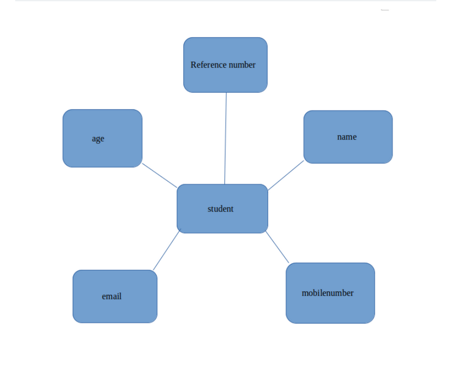
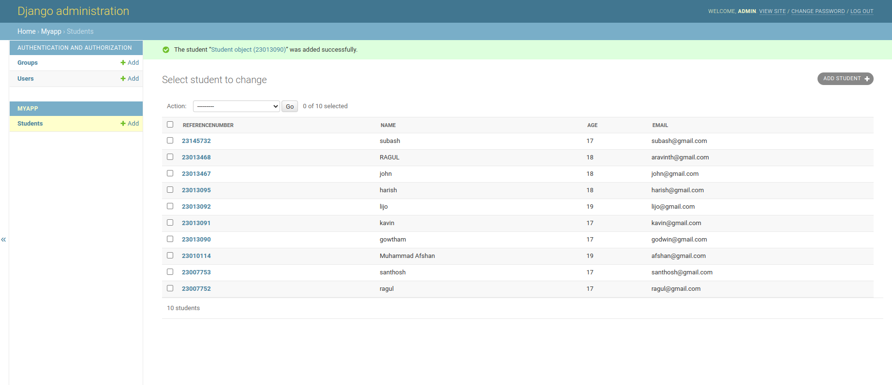
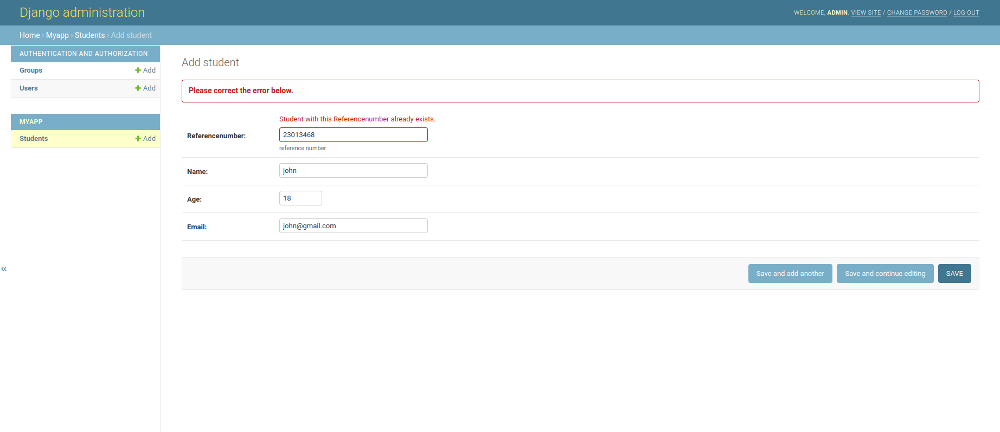

# Django ORM Web Application

## AIM
To develop a Django application to store and retrieve data from a database using Object Relational Mapping(ORM).
## DESIGN STEPS
## Entity Relationship Diagram


### STEP 1:
Clone the repository in ex02 from github
### STEP 2:
Move to project directory where manage.py is located and create newapp in Django project (python3 manage.py startapp myapp)
### STEP 3:
Then, change necessary things in settings.py and add the required codes to models.py and admin.py

### STEP 4:

Then, migrate the codes using the required command and run the server. 
## PROGRAM

#### CODE FROM MODELS.PY:
```
from django.db import models
from django.contrib import admin

# Create your models here.
class Student (models.Model):
    referencenumber=models.CharField(primary_key=True,max_length=20,help_text="reference number")
    name=models.CharField(max_length=100)
    age=models.IntegerField()
    email=models.EmailField()


class StudentAdmin(admin.ModelAdmin):
    list_display=('referencenumber','name','age''email')

```

### CODE FROM ADMINS.PY:
```
from django.contrib import admin
from .models import Student,StudentAdmin


# Register your models here.
admin.site.register(Student,StudentAdmin)
```


## OUTPUT
### STUDENT DETAILS:

### ERROR:

## RESULT
Thus the program for creating the database using Django ORM has been executed successfully.